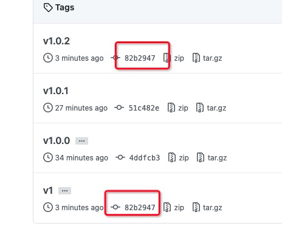
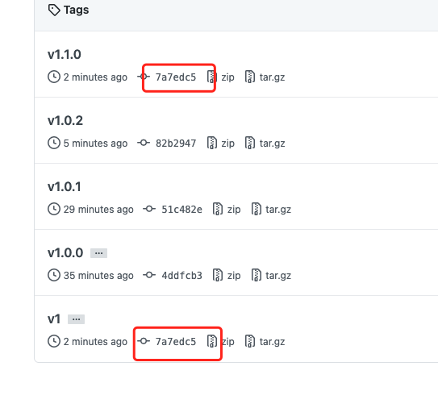

# Test CI Version

## 测试

https://github.com/actions-cool/test-ci-version/issues/1

### 发布 v1.0.0

- In: v1.0.0
- Out: v1.0.0

### 发布 v1.0.1

- In: v1.0.0
- Out: v1.0.0

---

- In: v1.0.1
- Out: v1.0.1

---
- In: v1.0
- Out: Unable to resolve action `actions-cool/test-ci-version@v1.0`, unable to find version `v1.0`

---
- In: v1
- Out: Unable to resolve action `actions-cool/test-ci-version@v1`, unable to find version `v1`

## 结论

当找不到版本时，会报错。

## 疑问

https://github.com/marketplace/actions/checkout

经常看到 `actions/checkout@v2` `actions/checkout@v1`，发现 actions/checkout 库并没有对应 v2 发布版和 v2 分支。

## 答案

答案在 tag 上。

`actions/checkout` 每次 release 后，会删除原有大版本 tag，再新建 tag。

- 当已拥有 v1 tag 后，若新建分支 v1，则 action 会使用 v1 分支代码。

操作如下：

```sh
# 删除 v1 tag
git push origin :refs/tags/v1
# 把最新的 v1.1.0 推送到 远端 v1 tag
git push origin v1.1.0:v1
```

这样就实现了 v1 tag 保持最新 release 功能。还有一种思路是 新建 v1 分支。master 分支代码合并到 v1 分支里。




